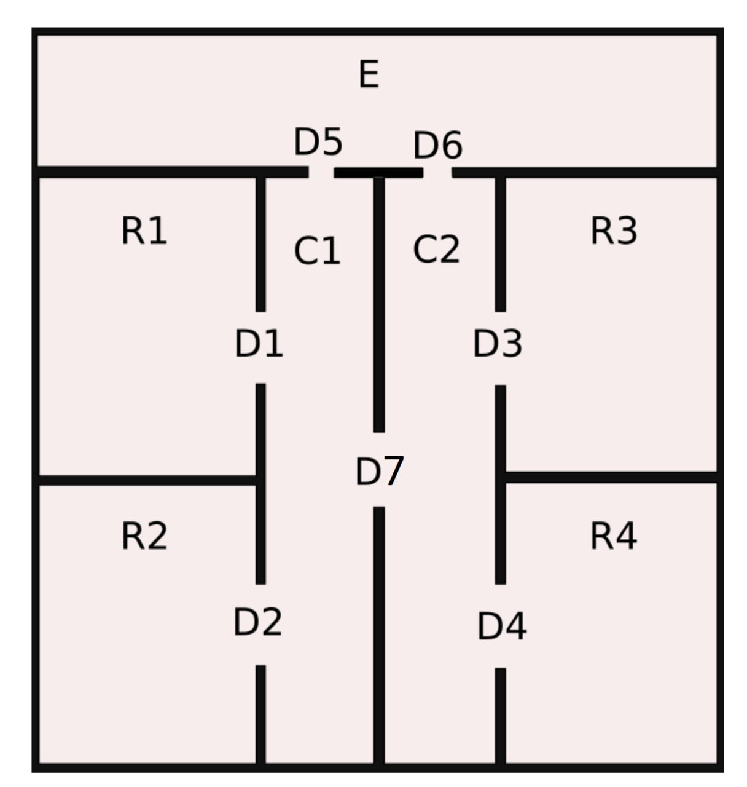

.. ros_gmapping_movebase documentation master file, created by
   sphinx-quickstart on Sat Mar 26 11:16:19 2022.
   You can adapt this file completely to your liking, but it should at least
   contain the root `toctree` directive.

Welcome to ontological_robot_control's documentation!
======================================================
.. toctree::
   :maxdepth: 2
   :caption: Contents:

Introduction
=============
This package is an experiment to use a topogical map ontology for controling a robot in ROS through
aRMOR service. The ontology consists of an indoor environment with multiple rooms and a mobile robot.

The robot start in the E location and waits until it receives the information to build the
topological map, i.e., the relations between C1, C2, R1, R2, R3 locations and the doors D1...D6.
The robot moves in a new location, and waits for some times before to visit another location. This
behavior is repeated in a infinite loop. 

When the robot battery is low, it goes in the E
location, and wait for some times before to start again with the above behavior.

When robot battery is not low, it should move among locations with this policy:

#. It should mainly stay on corridors,
#. If a reachable room has not been visited for some times it should visit it.

Contents
==========
.. toctree::
   :maxdepth: 2

   software_architecture
   scripts
   usage

   
Indices and tables
==================
* :ref:`genindex`
* :ref:`modindex`
* :ref:`search`
