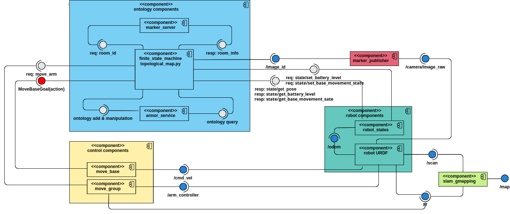

Software Architucture
=========================
In order to simulate the movements of the robot and its stimulus, the approach presented in the 
`arch_skeleton <https://github.com/buoncubi/arch_skeleton>`_ example is used with some changes
(e.g. planner and controller delay time, battery level).

Other main part of software architucture consists of finite state machine which is based on `smach <http://wiki.ros.org/smach>`_ for having a better 
overview of process states and transitions among them and `aRMOR <https://github.com/EmaroLab/armor>`_ 
for using the ontology of topogical map for controling the robot in ROS.

The software architucture is represented in the following figure.

The components of this software architucture can be described as follows:

robot-state
-------------

The ``robot-state`` is a node that encodes the knowledge shared among the other components,
and it implements two services for robot position (i.e., ``state/set_pose`` and ``state/get_pose``) 
and two other for robot battery level (i.e., ``state/set_battery_level`` and ``state/get_battery_level``)

motion planner
----------------
The planner node implements an action server named ``motion/planner``. This is done by the means of the 
``SimpleActionServer`` class based on the ``Plan`` action message. This action server requires the ``state/get_pose/`` 
service of the ``robot-state`` node, and a ``target`` point given as goal.

Given the current and target points, this component returns a plan as a list of ``via_points``, which only 
consist of the starting and ending points for simplicity. Morever the delay time for generating the path
is considered to be small to prevent conflicts between robot real situation and finite state machine.
When a new ``via_points`` is generated, the updated plan is provided as ``feedback``. When all the 
``via_points`` have been generated, the plan is provided as ``results``.

There is also a ``planner_client`` node, which gets the target point from ``finite_state_machine`` node
through ``/target_point`` topic and sends it to the planner server as action goal. When the result is found
as it is described above, publishes it to the ``/path`` topic to be used by the ``controller_client`` node.

motion controller
-----------------
The ``controller`` node implements an action server named ``motion/controller``. This is done by the means of the 
``SimpleActionServer`` class based on the ``Control`` action message. This action server requires the 
``state/set_pose/`` service of the ``robot-state`` node and a plan given as a list of ``via_points`` by the 
``planner``. 

Given the plan and the current robot position, this component iterates for each planned ``via_point`` and 
waits to simulate the time spent moving the robot to that location. The waiting time is computed using the 
roobot speed and the eucledian distance between the points. Each time a ``via_point`` is reached the 
``state/set_pose`` service is invoked, and a ``feedback`` is provided. When the last ``via_point`` is reached, 
the action service provides a result by propagating the current robot position, which has been already updated 
through the ``state/set_pose`` service. Morever in each movement step, the robot battery level is read by the
``controller`` node using ``state/get_battery_level`` and after decreasing gets set through ``state/set_battery_level``.

The provided ``controller_client`` node, subscribes ``/path`` topic to get the ``via_points`` and then sends them
to the ``controller`` server as an action goal.

finite state machin - aRMOR
-----------------------------
Defines the states and transitions for the finite state machine of the topological map, it also 
uses ``topological_map.py`` helper script to update the ontology while the process is running, and 
retreives the target room based on last visit times, finaly sends the target room pose to the 
``planner_client`` through ``/target_point`` in order to find the path.

node graph
-----------

The node graph is represented in the following figure.

.. image:: diagrams/rosgraph.png
  :width: 800
  :align: center
  :alt: rosgraph
